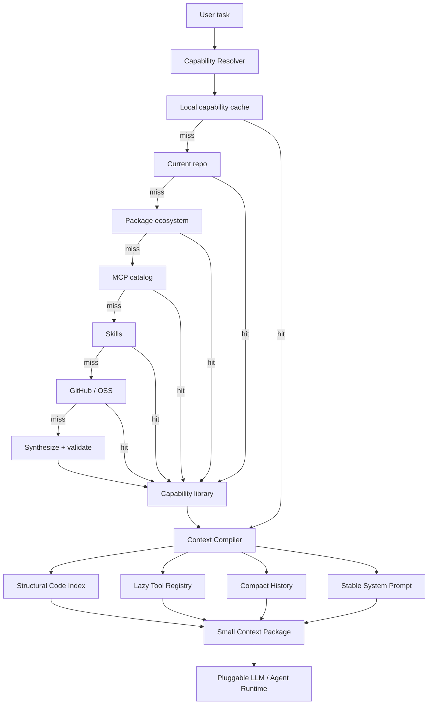

# Agent Sufficiency System

> **How little context does an agent actually need to solve a task well?**

Agent Sufficiency System is a compact research prototype for reducing **both the context an agent consumes and the amount of work it has to reinvent**.

Instead of treating a large context window as free storage—or treating every capability request as a fresh implementation problem—the system first asks whether enough capability already exists, then compiles only the minimum working context needed to use it.

The project now studies a broader objective:

```text
Agent Sufficiency
= minimum context
+ maximum capability reuse
+ minimum net-new reasoning
```

The current prototype focuses on coding-agent workloads, but the architecture is intentionally general.

---

## TL;DR

On a deterministic **40-task code-navigation benchmark** over the installed NetworkX package:

| Metric | Raw grep/read agent | Token-min hybrid | Change |
|---|---:|---:|---:|
| Mean input context / turn | 25,953 tokens | **3,151 tokens** | **-87.9%** |
| Context size ratio | 1.00× | **0.12×** | **8.24× smaller** |
| P95 input context | 42,366 | **3,786** | **-91.1%** |
| Final-turn context | 42,305 | **3,222** | **-92.4%** |
| Target-file coverage | 100% | **100%** | preserved |
| Target-symbol coverage | 100% | **100%** | preserved |
| Mean context-build latency | 2.456 ms | **0.295 ms** | lower |

**Important:** this is a **context-efficiency benchmark**, not yet an end-to-end coding-quality benchmark. It proves that the required target file/symbol survives aggressive context reduction on these tasks; it does not yet prove equal patch correctness from an LLM.

Full methodology and limitations: **[REPORT.md](REPORT.md)**  
Raw per-turn measurements: **[results/results.csv](results/results.csv)**  
Aggregate machine-readable results: **[results/results.json](results/results.json)**

### Capability-reuse benchmark

A second deterministic experiment evaluates the new **search-first capability resolver** over 30 unique capabilities repeated four times:

| Metric | Build every time | Search-first learning | Change |
|---|---:|---:|---:|
| Total requests | 120 | 120 | same workload |
| Net-new implementations | 120 | **8** | **-93.3%** |
| Reuse rate | 0% | **93.3%** | +93.3 pp |
| Local capability-cache hits | 0 | **90 / 120** | **75% of requests** |
| Search probes | 0 | 223 | deliberate discovery cost |
| Mean work-proxy tokens / request | 1,943 | **257** | **-86.8% total proxy work** |
| Total work-proxy tokens | 233,180 | **30,811** | **-86.8%** |

The 22 reusable capabilities are distributed across deterministic repo/package/MCP/skill/GitHub fixtures; eight capabilities are true misses and therefore require synthesis once. After adoption or synthesis, the learning policy stores compact capability metadata and resolves later requests from the local cache.

**Important:** the proxy-token metric counts a deterministic plan/code/test/debug artifact. It is **not billed LLM usage**. The strongest structural result is implementation count: **120 → 8**.

Capability benchmark report: **[results/capability_reuse/REPORT.md](results/capability_reuse/REPORT.md)**  
Aggregate results: **[results/capability_reuse/results.json](results/capability_reuse/results.json)**  
Summary table: **[results/capability_reuse/summary.csv](results/capability_reuse/summary.csv)**

---

## Why this exists

A naive agent often grows context like this:

```text
system prompt
+ every tool schema
+ full conversation history
+ old tool outputs
+ whole files / large grep results
+ current task
= increasingly expensive model call
```

That creates four independent sources of waste:

1. **Retrieval waste** — reading entire files when only one symbol and its dependencies matter.
2. **Tool-schema waste** — sending dozens of irrelevant tool definitions on every turn.
3. **Memory waste** — replaying old transcripts and tool payloads instead of a compact task checkpoint.
4. **Reimplementation waste** — asking the model to design, code, test, and debug a capability that already exists or was already built earlier.

The core hypothesis of this project is:

> Agent quality should depend on the **sufficiency of the working set**, not on how much historical context can be stuffed into the prompt.

The long-term optimization target is therefore not simply “tokens per API call”, but:

```text
total tokens consumed
────────────────────────
successfully solved tasks
```

---

## Core idea

Treat the LLM context window more like a **CPU cache** than a database.

```text
L1  Current model context
    Small, task-specific working set

L2  Task checkpoint
    Decisions, progress, compact state

L3  Retrieval indexes
    Symbols, dependencies, memories, tool metadata

L4  Raw storage
    Repository, logs, documents, full history
```

Only L1 is sent to the model. Everything else stays external and is paged in on demand.

---

## Architecture

### Current prototype



There are now two independent optimization loops:

```text
Capability loop: search -> adopt/build -> validate -> remember -> reuse
Context loop:    retrieve -> budget -> compile -> model call -> checkpoint
```

The resolver reduces **how often the model must create something new**. The context compiler reduces **how much information the model must see when it does work**. Both layers remain independent of a specific LLM SDK or orchestration framework.

### Main components

| Component | Purpose | Current implementation |
|---|---|---|
| Capability resolver | Search before synthesizing new functionality | Layered exact/alias catalogs |
| Capability library | Reuse adopted/generated capabilities across later tasks | Compact local metadata cache |
| Structural retrieval | Avoid whole-file / whole-repo context | Python AST symbol index |
| Lazy tools | Avoid sending every tool schema | Tool index + code-tool loading |
| Compact memory | Stop history from growing linearly | Checkpoint + recent-turn window |
| Stable prefix | Keep fixed instructions short and cache-friendly | Small stable system prompt |
| Context compiler | Assemble only the required working set | `TokenMinAgent.compile_context()` |
| Token accounting | Measure each context component | `tiktoken` when installed, transparent fallback otherwise |

Core context implementation: **[`src/agent_sufficiency_system/core.py`](src/agent_sufficiency_system/core.py)**  
Capability resolver: **[`src/agent_sufficiency_system/capabilities.py`](src/agent_sufficiency_system/capabilities.py)**

---

## What the benchmark isolates

The benchmark compares five policies under the **same 40-task stream**.

### 1. Full-repo upper bound

```text
whole repository
+ all tool schemas
+ full growing history
```

This is intentionally unrealistic and exists only as an upper bound.

### 2. Raw grep/read agent

```text
exact-symbol grep
+ up to five whole matching files
+ all tool schemas
+ full growing history
```

This is the practical baseline.

### 3. Structural graph retrieval only

```text
exact symbol snippet
+ file / line metadata
+ imports
+ a few call neighbors
+ all tool schemas
+ full growing history
```

This isolates the value of Graphify-like structural retrieval.

### 4. Compact state + lazy tools

```text
raw-file retrieval
+ compact checkpoint
+ recent turns only
+ code tools only
```

This isolates state/tool-context savings.

### 5. Token-min hybrid

```text
structural symbol retrieval
+ lazy tool loading
+ compact memory
+ stable short system prompt
```

This combines all three major savings mechanisms.

---

## Results

### Mean context per turn

| Policy | Mean tokens | Reduction vs raw grep | Relative size | Target symbol hit |
|---|---:|---:|---:|---:|
| Full repo upper bound | 1,639,383 | — | 63.17× raw | 100% |
| Raw grep/read | 25,953 | baseline | 1.00× | 100% |
| Structural graph only | 18,295 | **29.5%** | 0.705× | 100% |
| Compact state + lazy tools | 8,984 | **65.4%** | 0.346× | 97.5% |
| **Token-min hybrid** | **3,151** | **87.9%** | **0.121×** | **100%** |

### Visual comparison

```text
Mean estimated input context / turn

Full repo upper bound   1,639,383  ████████████████████████████████████████  (off-scale)
Raw grep/read              25,953  ████████████████████████████████████████
Graph retrieval            18,295  ████████████████████████████
Compact + lazy tools        8,984  ██████████████
Token-min hybrid            3,151  █████
```

The full-repo number is intentionally off-scale; the meaningful comparison is between the four practical policies.

### Where the tokens go

Average context composition:

| Component | Raw grep/read | Token-min hybrid | Reduction |
|---|---:|---:|---:|
| Tool schemas | 8,456 | **1,013** | **88.0%** |
| Memory / history | 8,650 | **1,066** | **87.7%** |
| Retrieved code | 8,754 | **970** | **88.9%** |
| System + query | ~93 | ~102 | intentionally small |
| **Total** | **25,953** | **3,151** | **87.9%** |

This is the most important result of the prototype:

> **Structural retrieval alone is not enough.**

Graph-style code retrieval saves about **29.5%** versus the raw baseline, but the largest reduction appears only when retrieval is combined with **lazy tool loading and compact external state**.

### Long-horizon behavior

By turn 40, the difference is larger because the raw agent keeps accumulating history:

```text
Raw grep/read     42,305 tokens
Token-min hybrid   3,222 tokens
                 ─────────────
                  92.4% smaller
                  ~13.1× reduction
```

The hybrid context remains roughly bounded while the raw-history baseline continues to grow.

---

## Benchmark setup

The checked-in result was produced with:

| Property | Value |
|---|---:|
| Corpus | NetworkX Python package |
| Python files indexed | 580 |
| Corpus size | 6,462,763 characters |
| Tasks | 40 |
| Policies | 5 |
| Raw measurement rows | 200 |
| Simulated tool definitions | 48 |
| Task seed | 7 |
| Target generation | AST-grounded unique symbols |

Each task asks the agent context layer to locate a known symbol, its source file, implementation, and enough structural context for a safe edit.

The benchmark knows the target symbol/file in advance, so it can verify whether compression accidentally removes required evidence.

### Token counting

The benchmark uses:

- **`tiktoken`** when available;
- otherwise a transparent **`ceil(chars / 4)`** estimate.

The checked-in run used the fallback estimator, so absolute token counts should be interpreted as estimates. The relative context-size reductions remain directly auditable from the underlying character counts.

---

## Graphify vs LangGraph

They operate at different layers.

| | Graphify / Graphify-like | LangGraph |
|---|---|---|
| Primary role | Code/context retrieval | Agent orchestration |
| Main question | “What evidence should the model see?” | “What node runs next and what state exists?” |
| Direct token impact | Often large | Depends on how context is assembled |
| Replacement for the other? | No | No |

The architecture this project is exploring is closer to:

```text
LangGraph or small custom runtime
              +
Graphify-like structural retrieval
              +
lazy tool loading
              +
compact external memory
              +
explicit context compiler
```

In other words, **Graphify-like retrieval is a context optimization technique; LangGraph is an orchestration substrate**. A LangGraph agent can still be token-heavy if every node receives full history.

The current prototype intentionally uses a tiny custom runtime so the token behavior remains easy to inspect.

---

## Repository layout

```text
agent_sufficiency_system/
├── README.md
├── REPORT.md
├── pyproject.toml
│
├── src/
│   └── agent_sufficiency_system/
│       ├── __init__.py
│       ├── capabilities.py
│       └── core.py
│
├── benchmarks/
│   ├── run_capability_benchmark.py
│   └── run_context_benchmark.py
│
├── tests/
│   ├── test_capabilities.py
│   └── test_core.py
│
└── results/
    ├── results.csv
    ├── results.json
    ├── REPORT.generated.md
    └── capability_reuse/
        ├── results.json
        ├── summary.csv
        └── REPORT.md
```

---

## Quick start

### Install

```bash
git clone https://github.com/kisibongtoi772/agent_sufficiency_system.git
cd agent_sufficiency_system

python -m pip install -e .
python -m pip install networkx
```

Optional tokenizer-accurate measurement:

```bash
python -m pip install tiktoken
```

### Run the benchmark

```bash
PYTHONPATH=src python benchmarks/run_context_benchmark.py \
  --tasks 40 \
  --out results
```

### Run the capability-reuse benchmark

```bash
PYTHONPATH=src python benchmarks/run_capability_benchmark.py \
  --out results/capability_reuse
```

The runner also emits a raw per-request `results.csv` locally; the repository keeps compact aggregate artifacts under `results/capability_reuse/`.

### Benchmark another Python repository

```bash
PYTHONPATH=src python benchmarks/run_context_benchmark.py \
  --repo /path/to/repository \
  --tasks 40 \
  --out results
```

### Run regression tests

```bash
PYTHONPATH=src python -m unittest discover -s tests -v
```

---

## Design principles

### 1. Context is working memory, not storage

Raw history, logs, repositories, and artifacts should live outside the model context.

### 2. Retrieve structure before text

A coding task usually needs a symbol, its local implementation, and a small dependency neighborhood—not five entire files.

### 3. Load tools progressively

The model should see a compact tool index first and receive full schemas only for tools relevant to the current task.

### 4. Checkpoint state instead of replaying it

Persist task facts and decisions as compact deltas. Do not carry old tool payloads forever.

### 5. Keep the stable prefix stable

Short, deterministic instructions are easier to cache and cheaper to reuse.

### 6. Search before synthesis

Before generating a new tool or helper, search progressively through the capability cache, current repo, packages, MCPs, skills, and OSS. After a capability is validated, remember it so repeated work collapses to a cache lookup.

### 7. Optimize for solved-task efficiency

The eventual objective is not the smallest prompt at any cost. It is the lowest:

```text
tokens + latency + dollars
──────────────────────────
successfully solved tasks
```

subject to quality staying constant.

---

## What is implemented today

- [x] Python AST structural symbol index
- [x] Exact symbol/file/line retrieval
- [x] Small structural-neighbor expansion
- [x] Lazy code-tool schema loading
- [x] Compact checkpoint memory
- [x] Full-history baseline
- [x] Raw grep/read baseline
- [x] Per-component token accounting
- [x] Deterministic 40-task benchmark
- [x] Raw CSV + aggregate JSON artifacts
- [x] Regression tests
- [x] Search-first capability resolver
- [x] Capability cache for adopted and synthesized functionality
- [x] Deterministic capability-reuse benchmark
- [x] Capability benchmark JSON/CSV/report artifacts

## Next steps

- [ ] Replace capability benchmark fixtures with live package/MCP/skill/GitHub providers
- [ ] Add semantic/embedding matching for non-exact capability requests
- [ ] Add compatibility scoring before adopting third-party capabilities
- [ ] Add a real LLM adapter while holding the model fixed across policies
- [ ] Measure **task success / pass@1**, not only context coverage
- [ ] Measure actual billed input/output tokens
- [ ] Report **cost per solved task**
- [ ] Add tool-call and end-to-end latency measurements
- [ ] Benchmark long-running tasks where memory growth matters more
- [ ] Add multi-language code indexing beyond Python AST
- [ ] Compare the custom runtime against a LangGraph implementation using the same context compiler
- [ ] Add retrieval-quality failures and fallback escalation
- [ ] Explore learned / adaptive context budgeting

---

## Limitations

This first benchmark is deliberately small and interpretable.

It does **not** yet establish that an LLM receiving the reduced context will produce an equally correct code change. Current “coverage” means the known target file and symbol remain present after context compilation.

Other limitations:

- the checked-in run uses an estimated tokenizer;
- tasks are symbol-navigation tasks, not full software-engineering tickets;
- the structural index currently targets Python;
- the tool registry is simulated for controlled measurement;
- no external vector database or learned retriever is used;
- the benchmark corpus is one codebase.

These are intentional constraints for the first experiment, not claims of production readiness.

---

## Research notes

The project was motivated by a broader shift from **“bigger context”** toward **context engineering**:

- Graphify treats code structure as a knowledge graph so an assistant can query symbols and relationships instead of repeatedly scanning raw files.
- LangGraph provides graph/state orchestration, but prompt size still depends on what each node chooses to send to the model.
- Modern agent systems increasingly separate persistent state, retrieval, tools, and the small working context used for each model call.

See **[REPORT.md](REPORT.md)** for the current source notes and benchmark caveats.

---

## Reproducibility

The benchmark runner writes:

- `results/results.csv` — all per-turn measurements;
- `results/results.json` — metadata and aggregate summary;
- `results/REPORT.generated.md` — report generated from the run.

This keeps the headline README numbers traceable back to machine-readable artifacts.
