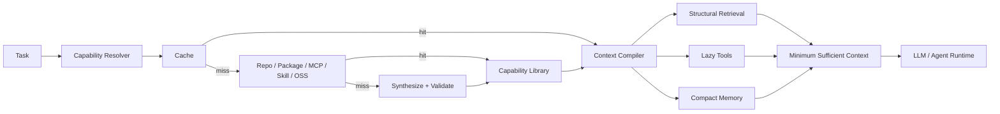

# Agent Sufficiency System

> **Build agents that see less, reuse more, and implement less from scratch.**

```text
Agent Sufficiency
= minimum context
+ maximum capability reuse
+ minimum net-new reasoning
```

This project explores two complementary ways to make tool-using agents more efficient:

1. **Context sufficiency** — send only the smallest useful working set to the model.
2. **Capability sufficiency** — search and reuse existing capabilities before generating new code.

The current prototype is intentionally small and framework-agnostic so each source of savings can be measured independently.

---

## Key results

### 1. Context efficiency

Deterministic 40-task code-navigation benchmark on NetworkX:

| Metric | Raw grep/read | Token-min hybrid | Improvement |
|---|---:|---:|---:|
| Mean input context / turn | 25,953 | **3,151** | **-87.9%** |
| P95 context | 42,366 | **3,786** | **-91.1%** |
| Final-turn context | 42,305 | **3,222** | **-92.4%** |
| Target-file coverage | 100% | **100%** | preserved |
| Target-symbol coverage | 100% | **100%** | preserved |
| Mean context-build latency | 2.456 ms | **0.295 ms** | lower |

```text
Mean estimated input context / turn

Full repo upper bound   1,639,383  ████████████████████████████████████████  (off-scale)
Raw grep/read              25,953  ████████████████████████████████████████
Graph retrieval            18,295  ████████████████████████████
Compact + lazy tools        8,984  ██████████████
Token-min hybrid            3,151  █████
```

The main finding is that **structural retrieval alone is not enough**. The largest reduction comes from combining:

```text
structural retrieval
+ lazy tool loading
+ compact external memory
+ short stable prompt
```

Average context breakdown:

| Component | Raw grep/read | Token-min hybrid | Reduction |
|---|---:|---:|---:|
| Tool schemas | 8,456 | **1,013** | **88.0%** |
| Memory/history | 8,650 | **1,066** | **87.7%** |
| Retrieved code | 8,754 | **970** | **88.9%** |

---

### 2. Capability reuse

Deterministic benchmark with **30 unique capabilities × 4 repetitions = 120 requests**:

| Metric | Build every time | Search-first learning | Improvement |
|---|---:|---:|---:|
| Net-new implementations | 120 | **8** | **-93.3%** |
| Reuse rate | 0% | **93.3%** | +93.3 pp |
| Capability-cache hits | 0 | **90 / 120** | **75% of all requests** |
| Work-proxy tokens | 233,180 | **30,811** | **-86.8%** |

Search order:

```text
local cache
   ↓ miss
current repo
   ↓ miss
package ecosystem
   ↓ miss
MCP
   ↓ miss
skills
   ↓ miss
GitHub / OSS
   ↓ miss
synthesize + validate
   ↓
remember for reuse
```

The strongest structural result is:

```text
new implementations
120  →  8
       -93.3%
```

---

## Architecture



Two optimization loops work together:

```text
Capability loop
search → reuse/build → validate → remember

Context loop
retrieve → budget → compile → model → checkpoint
```

The first minimizes **how often new work must be created**.  
The second minimizes **how much information the model must process**.

---

## Optimization strategy

The prototype currently applies five ideas:

- **Search before synthesis** — do not implement a capability until local and external reuse paths miss.
- **Learn after first use** — cache validated capabilities so repeated requests collapse to lookup.
- **Retrieve structure, not whole files** — use symbol-level AST context and small dependency neighborhoods.
- **Load tools lazily** — expose only the schemas needed for the current task.
- **Keep memory external** — retain compact checkpoints instead of replaying full transcripts and tool outputs.

---

## Repository

```text
src/agent_sufficiency_system/
├── core.py                  # context compiler
└── capabilities.py          # search-first capability resolver

benchmarks/
├── run_context_benchmark.py
└── run_capability_benchmark.py

results/
├── results.json
├── results.csv
└── capability_reuse/
    ├── results.json
    ├── summary.csv
    └── REPORT.md
```

### Reproduce

```bash
python -m pip install -e .
python -m pip install networkx

PYTHONPATH=src python benchmarks/run_context_benchmark.py --tasks 40 --out results
PYTHONPATH=src python benchmarks/run_capability_benchmark.py --out results/capability_reuse
```

---

## References and limitations

Detailed methodology, assumptions, and source notes live outside the README:

- **[REPORT.md](REPORT.md)** — context benchmark methodology and research notes
- **[results/results.csv](results/results.csv)** — raw context measurements
- **[results/results.json](results/results.json)** — aggregate context results
- **[results/capability_reuse/REPORT.md](results/capability_reuse/REPORT.md)** — capability benchmark
- **[results/capability_reuse/results.json](results/capability_reuse/results.json)** — aggregate capability results

The checked-in context run used the transparent `ceil(chars / 4)` token estimate because `tiktoken` was unavailable in that environment. The capability benchmark uses deterministic offline search fixtures and a plan/code/test/debug **work proxy**; those proxy tokens are not billed LLM tokens.

The next important validation step is an end-to-end benchmark with the **same real model** across policies, measuring task success, billed tokens, tool calls, latency, and cost per solved task.
