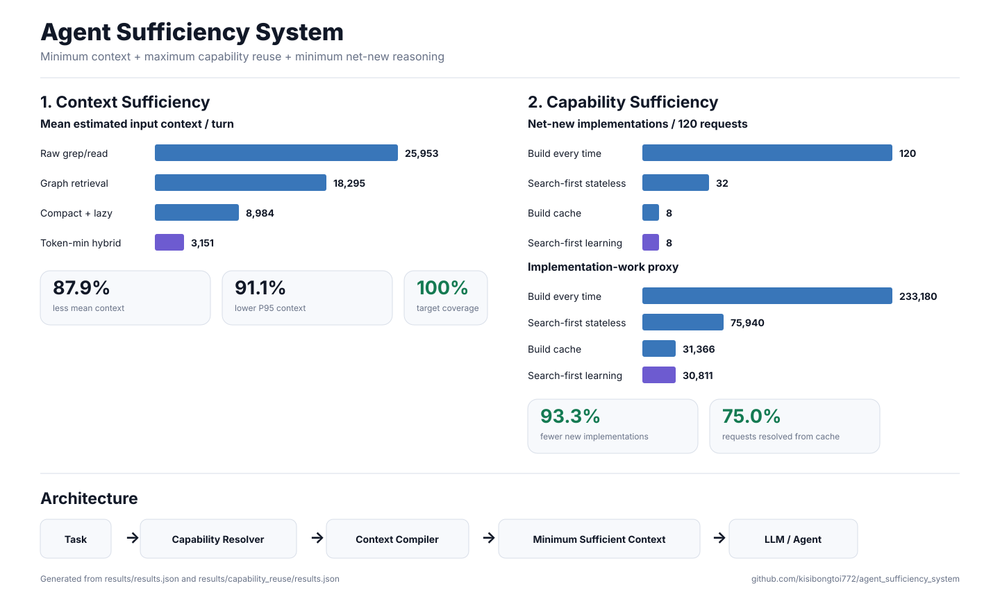
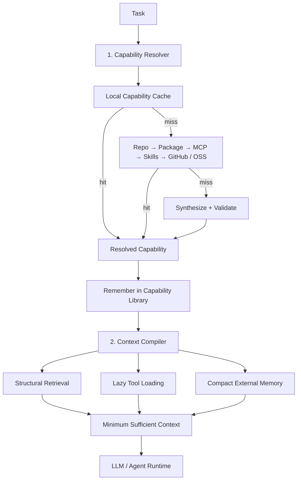

# Agent Sufficiency System

> **Build agents that see less, reuse more, and implement less from scratch.**

```text
Agent Sufficiency
= minimum context
+ maximum capability reuse
+ minimum net-new reasoning
```

This project studies two complementary questions:

1. **Context sufficiency** — what is the minimum useful context the model needs?
2. **Capability sufficiency** — does the agent need to build this at all, or can it reuse something that already exists?

The prototype is intentionally small and framework-agnostic so each source of savings can be measured independently.



The visualization above is generated directly from the checked-in benchmark JSON files:

```bash
python scripts/generate_visualization.py
```


---

## Key results

### 1. Context efficiency

Deterministic **40-task code-navigation benchmark** on NetworkX:

| Metric | Raw grep/read | Token-min hybrid | Improvement |
|---|---:|---:|---:|
| Mean input context / turn | 25,953 | **3,151** | **-87.9%** |
| P95 context | 42,366 | **3,786** | **-91.1%** |
| Final-turn context | 42,305 | **3,222** | **-92.4%** |
| Target-file coverage | 100% | **100%** | preserved |
| Target-symbol coverage | 100% | **100%** | preserved |
| Mean context-build latency | 2.456 ms | **0.295 ms** | lower |

```text
Mean estimated input context / turn

Full repo upper bound   1,639,383  ████████████████████████████████████████  (off-scale)
Raw grep/read              25,953  ████████████████████████████████████████
Graph retrieval            18,295  ████████████████████████████
Compact + lazy tools        8,984  ██████████████
Token-min hybrid            3,151  █████
```

The largest reduction comes from combining:

```text
structural retrieval
+ lazy tool loading
+ compact external memory
+ short stable prompt
```

Average context breakdown:

| Component | Raw grep/read | Token-min hybrid | Reduction |
|---|---:|---:|---:|
| Tool schemas | 8,456 | **1,013** | **88.0%** |
| Memory/history | 8,650 | **1,066** | **87.7%** |
| Retrieved code | 8,754 | **970** | **88.9%** |

---

### 2. Capability reuse

Deterministic benchmark with **30 unique capabilities × 4 repetitions = 120 requests**:

| Metric | Build every time | Search-first learning | Improvement |
|---|---:|---:|---:|
| Net-new implementations | 120 | **8** | **-93.3%** |
| Reuse rate | 0% | **93.3%** | +93.3 pp |
| Capability-cache hits | 0 | **90 / 120** | **75% of all requests** |
| Work-proxy tokens | 233,180 | **30,811** | **-86.8%** |

```text
Net-new implementations / 120 requests

Build every time             120  ████████████████████████████████████████
Search-first stateless        32  ███████████
Search-first + build cache     8  ███
Search-first learning          8  ███
                                   ↓
                              93.3% fewer
```

```text
Estimated implementation-work proxy

Build every time          233,180  ████████████████████████████████████████
Search-first stateless     75,940  █████████████
Build cache                31,366  █████
Search-first learning      30,811  █████
                                   ↓
                              86.8% lower
```

Search-first learning turns repeated implementation into reuse:

```text
cache → repo → package → MCP → skills → GitHub/OSS
                                          │
                                          └─ miss → synthesize + validate
                                                       │
                                                       ▼
                                                  remember
                                                       │
                                                       └─ future request → cache hit
```

The strongest structural result is **120 → 8 new implementations**.

---

## Architecture

The system has two stages: **reuse as much capability as possible first, then minimize the context required to use it**.



```text
Capability loop
search → reuse/build → validate → remember

Context loop
retrieve → budget → compile → model → checkpoint
```

The capability layer minimizes **how often new work is created**.  
The context layer minimizes **how much information the model processes**.

---

## Optimization strategy

- **Search before synthesis** — only build after reuse paths miss.
- **Learn after first use** — cache validated capabilities for later requests.
- **Retrieve structure, not whole files** — use symbol-level AST context.
- **Load tools lazily** — expose only relevant schemas.
- **Keep memory external** — checkpoint state instead of replaying full history.

---

## Roadmap

| Phase | Goal | Status |
|---|---|---|
| **1. Context Sufficiency** | Structural retrieval + lazy tools + compact memory | Done |
| **2. Capability Sufficiency** | Search-first resolver + capability cache | Prototype + benchmark complete |
| **3. Live Capability Discovery** | Real package/MCP/skill/GitHub providers, semantic matching, compatibility scoring | Next |
| **4. End-to-End Validation** | Same real LLM across policies; measure pass@1, billed tokens, latency, tool calls, cost / solved task | Planned |

Longer-term: adaptive context budgets, learned routing, multi-language code indexing, and persistent capability quality scoring.

---

## Repository

```text
src/agent_sufficiency_system/
├── core.py                  # context compiler
└── capabilities.py          # search-first capability resolver

benchmarks/
├── run_context_benchmark.py
└── run_capability_benchmark.py

results/
├── results.json
├── results.csv
└── capability_reuse/
    ├── results.json
    ├── summary.csv
    └── REPORT.md
```

### Reproduce

```bash
python -m pip install -e .
python -m pip install networkx

PYTHONPATH=src python benchmarks/run_context_benchmark.py --tasks 40 --out results
PYTHONPATH=src python benchmarks/run_capability_benchmark.py --out results/capability_reuse
```

---

## References and limitations

Detailed methodology and assumptions live in the benchmark reports:

- **[REPORT.md](REPORT.md)** — context benchmark methodology and research notes
- **[results/results.csv](results/results.csv)** — raw context measurements
- **[results/results.json](results/results.json)** — aggregate context results
- **[results/capability_reuse/REPORT.md](results/capability_reuse/REPORT.md)** — capability benchmark
- **[results/capability_reuse/results.json](results/capability_reuse/results.json)** — aggregate capability results

The checked-in context run used the transparent `ceil(chars / 4)` estimate because `tiktoken` was unavailable in that environment. The capability benchmark uses deterministic offline search fixtures and a plan/code/test/debug **work proxy**; those proxy tokens are not billed LLM tokens.

The next critical validation is an end-to-end benchmark with the **same real model** across policies, measuring task success, actual billed tokens, latency, tool calls, and cost per solved task.
